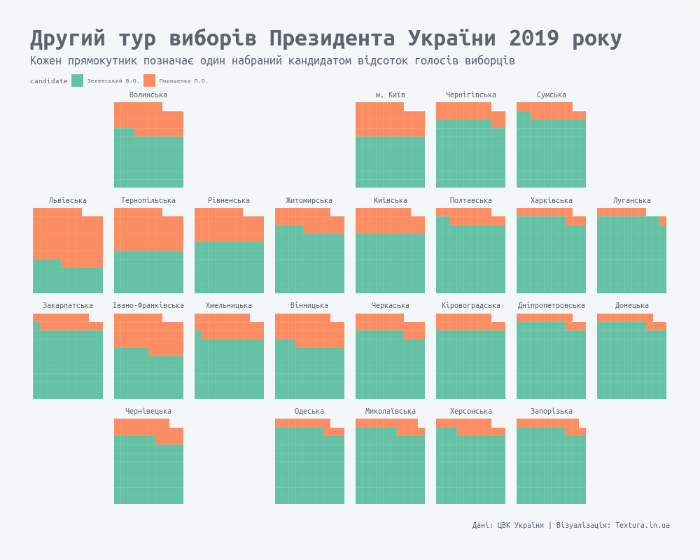

***

[waffle - Make waffle (square pie) charts in R ](https://github.com/hrbrmstr/waffle)

[geofacet](https://hafen.github.io/geofacet/)

[Creating a waffle plot together with facets in ggplot2](https://stackoverflow.com/questions/52741666/creating-a-waffle-plot-together-with-facets-in-ggplot2)